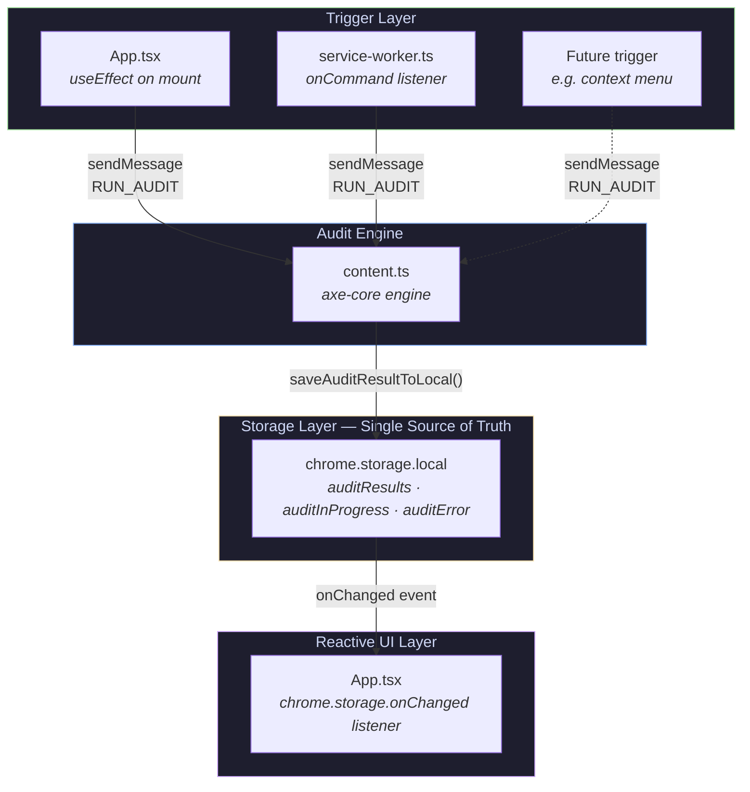

# Accessibility Checker Chrome Extension 🛡️

A modern, AI-powered Chrome Extension designed to seamlessly audit webpages for WCAG 2.1 accessibility violations and provide immediate, intelligent code-level remediation suggestions.

This project was built to empower developers to create more accessible web experiences with zero friction, directly from their browser.

---

## 🚀 Features

- **One-Click Auditing:** Instantly scan any webpage for WCAG 2.1 AA violations.
- **Categorized Results:** Sorts issues into intuitive Severity groups (Errors, Warnings, Notices).
- **AI-Powered Code Fixes:** Leverages Google Gemini models to explain _why_ an element fails and provides the exact React/HTML snippet to fix it.
- **Audit History:** Automatically saves your last 50 audits locally, with the ability to export them as raw JSON datasets.
- **BYOK (Bring Your Own Key):** Your API key is stored locally on your device using Chrome's built-in storage API — never sent to any server except Google's Gemini API.

---

## 🛠️ How to Run Locally

Because this project is built using modern tooling, hot-reloading works flawlessly out of the box—even for a Chrome Extension!

1. **Install Dependencies:**
   \`\`\`bash
   npm install
   \`\`\`

2. **Start the Development Server:**
   \`\`\`bash
   npm run dev
   \`\`\`
   _(This starts Vite and creates a continuously updated \`dist/\` folder in your project root.)_

3. **Load the Extension into Chrome:**
   - Open Google Chrome and navigate to \`chrome://extensions/\`
   - Enable the **"Developer mode"** toggle (top right corner).
   - Click the **"Load unpacked"** button.
   - Select the \`dist\` directory located inside your project folder.

4. **Develop with HMR:**
   - Pin the extension to your toolbar.
   - Any changes you make to the React UI will instantly reflect in the popup—try changing a color in \`src/App.tsx\`!
   - _(Note: If you encounter Content Security Policy (CSP) errors in the console from \`localhost\`, just click the circular "Reload" icon on the extension's card in the \`chrome://extensions/\` page!)_

---

## 🧠 How the Project Works (Architecture)

A Chrome extension isn't a single website—it's essentially three separate environments communicating with each other:

1. **The Popup UI (\`src/popup/\` equivalent -> \`src/App.tsx\`)**
   This is the React Single Page Application that opens when you click the extension icon. It acts as the "Director". When opened, it queries the active Chrome Tab and sends a \`RUN_AUDIT\` message to the Content Script.
2. **The Content Script (\`src/content/content.ts\`)**
   This script is injected directly into the DOM of the website you are currently viewing. When it receives the \`RUN_AUDIT\` message, it fires up the \`axe-core\` engine to analyze the page's HTML structure. It packages the raw violations, maps them to simpler severity tiers, and sends them back to the Popup UI for display.

3. **The Background Service Worker (\`src/background/service-worker.ts\`)**
   The Service Worker operates silently in the background of the browser. We use this strictly as an **Environment securely separated from the DOM** to handle our AI API calls securely (preventing CORS issues and keeping API keys out of the target webpage's memory scope).

---

## 🤖 How the AI Fix Engine Works

When a user clicks "Get AI Fix" on a specific violation in the Popup UI:

1. **Proxy Request:** The Popup UI sends a \`GET_AI_SUGGESTION\` message (containing the violation details and raw HTML node) to the Background Service Worker.
2. **Key Retrieval:** The Service Worker retrieves your API Key from `chrome.storage.local` (stored locally on-device, never synced or transmitted to third parties).
3. **Session Caching:** To save latency and API costs, the Service Worker checks \`chrome.storage.session\` (which is wiped when Chrome closes) to see if we've already generated a fix for this exact violation + HTML combo.
4. **Prompt Engineering:** If no cache exists, the Service Worker connects to the \`@google/generative-ai\` SDK. It wraps the violation metadata into a strict prompt that demands a structured JSON response containing:
   - \`explanation\`: A human-readable breakdown of the WCAG failure.
   - \`codeSnippet\`: The proposed structural fix.
   - \`wcagReference\`: The exact rule standard.
5. **Return:** The Service Worker returns the AI payload to the Popup UI, where it is beautifully rendered.

---

## 📖 The \`manifest.json\` Explained

The \`public/manifest.json\` is the "blueprint" that Chrome reads to understand what your extension is allowed to do.

- **\`manifest_version: 3\`**: Google's modern, heavily-secured standard for extensions.
- **\`permissions\`**:
  - \`activeTab\`: Allows us temporary access to the webpage to run the audit.
  - \`scripting\`: Required in MV3 to execute content scripts programmatically.
  - \`storage\`: Allows us to use `chrome.storage.local` (for API keys and History) and `chrome.storage.session` (for AI caching).
- **\`host_permissions\`**: \`<all_urls>\` ensures we can audit any webpage the user is on.
- **\`content_security_policy\`**: By default, MV3 heavily restricts where an extension can fetch data from. We specifically opened up \`connect-src\` to allow Vite's Hot Module Replacement (HMR) to talk to \`localhost\`, and to allow our Service Worker to securely contact the Google Gemini API endpoint (\`https://generativelanguage.googleapis.com\`).

---

## 📦 Why We Used These Specific Packages

| Package                   | Purpose              | Why We Chose It                                                                                                                                                                                                                                                                                              |
| :------------------------ | :------------------- | :----------------------------------------------------------------------------------------------------------------------------------------------------------------------------------------------------------------------------------------------------------------------------------------------------------- |
| **Vite / React SPA**      | Frontend Engine      | React is the industry standard for complex interactive UIs. Vite provides near-instant compilation and a vastly superior developer experience compared to Webpack or CRA.                                                                                                                                    |
| **@crxjs/vite-plugin**    | Extension Bundler    | Historically, building Chrome Extensions with React was a configuration nightmare. CRXJS acts as the bridge—parsing the \`manifest.json\` on the fly, enabling Vite's Hot Module Replacement _inside_ an extension environment, and correctly outputting multiple entry points (Popup, Content, Background). |
| **axe-core**              | Accessibility Engine | The absolute gold standard of automated accessibility testing. Maintained by Deque Systems, it is the exact same engine that powers Google Lighthouse and Microsoft Accessibility Insights.                                                                                                                  |
| **Tailwind CSS (v4)**     | Styling              | Allows for rapid prototyping of a premium, dark-mode-first aesthetic without writing bloated CSS files. V4 introduces lightning-fast engine compiling without needing a \`tailwind.config.js\` file.                                                                                                         |
| **Lucide React**          | Iconography          | Lightweight, crisp, and neutral SVG icons that easily match modern interface design patterns.                                                                                                                                                                                                                |
| **@google/generative-ai** | AI Integration       | The official SDK to interact with Gemini 3.0 flash preview. We chose Gemini Flash because it is incredibly fast (crucial for a snappy UI), accurate for code generation, and currently offers a generous free tier for developers.                                                                           |

## 📝 Learnings

### Problem: Workflow — `RUN_AUDIT`

The `RUN_AUDIT` workflow is the core functionality of the extension. It is responsible for triggering an accessibility audit on the active webpage and rendering the results in the Popup UI. Understanding the problem requires looking at the **two independent trigger points** and how they originally handled data flow differently.

#### Trigger Points

| #   | Trigger               | Origin                             | Entry Point                                                         |
| --- | --------------------- | ---------------------------------- | ------------------------------------------------------------------- |
| 1   | **Extension opened**  | User clicks the extension icon     | `App.tsx` → `useEffect` on mount                                    |
| 2   | **Keyboard shortcut** | User presses the configured hotkey | `manifest.json` → `service-worker.ts` → `chrome.commands.onCommand` |

---

#### ❌ Before: Dual-Path Architecture (The Problem)

Each trigger point used a **completely different data flow** to achieve the same outcome, leading to duplicated logic and inconsistent state management.

```mermaid
flowchart TD
    subgraph Path_A["Path A — Extension Popup"]
        A1["App.tsx<br/><i>useEffect on mount</i>"] -->|"sendMessage<br/>RUN_AUDIT"| A2["content.ts<br/><i>axe-core engine</i>"]
        A2 -->|"sendResponse<br/>AuditResult"| A3["App.tsx<br/><i>setState directly</i>"]
    end

    subgraph Path_B["Path B — Keyboard Shortcut"]
        B1["manifest.json<br/><i>command: run-audit</i>"] --> B2["service-worker.ts<br/><i>onCommand listener</i>"]
        B2 -->|"sendMessage<br/>RUN_AUDIT"| B3["content.ts<br/><i>axe-core engine</i>"]
        B3 -->|"sendResponse<br/>AuditResult"| B4["service-worker.ts<br/><i>receives result</i>"]
        B4 -->|"sendMessage<br/>AUDIT_RESULT"| B5["App.tsx<br/><i>onMessage listener</i>"]
    end

    style Path_A fill:#1e1e2e,stroke:#f38ba8,color:#cdd6f4
    style Path_B fill:#1e1e2e,stroke:#f38ba8,color:#cdd6f4
```

#### Identified Issues

- **Duplicated audit orchestration** — Both `App.tsx` and `service-worker.ts` independently called the content script with `RUN_AUDIT`, each managing the response lifecycle separately.
- **Inconsistent state management** — Path A used React `setState` directly, while Path B relayed data through an extra `AUDIT_RESULT` message hop, requiring a separate `onMessage` listener in the component.
- **Fragile error handling** — Each path had its own error handling logic with no shared contract, making it easy for one path to silently swallow failures.
- **Loading state divergence** — Path A managed `isAuditing` via `setState`, while Path B set `auditInProgress` in `chrome.storage.local`, meaning the UI had to watch two different sources of truth.
- **Poor scalability** — Adding a new trigger (e.g., context menu, DevTools panel) would require writing yet another bespoke data flow path.

#### Core Breakdown

Despite the two paths, the workflow always performs the **same three operations**:

1. **Run Audit** — Send `RUN_AUDIT` to the content script → execute `axe-core`.
2. **Persist Results** — Save the `AuditResult` to a shared location.
3. **Render Results** — Read the persisted results and update the UI.

> The fundamental problem was that each trigger point owned the _entire_ pipeline instead of only being responsible for **Step 1**.

---

#### ✅ After: Unified Storage-Driven Architecture (The Fix)

The fix decouples the trigger from the result consumption by using **`chrome.storage.local` as the single source of truth**. Any trigger writes to storage, and the UI reactively reads from it.

#### What Changed

- **Single write path** — Both triggers call the content script the same way. The content script (or the caller) persists the result using the shared `saveAuditResultToLocal()` utility, which writes to `chrome.storage.local`.
- **Reactive UI** — `App.tsx` listens to `chrome.storage.onChanged` for `auditResults`, `auditInProgress`, and `auditError` keys. It no longer cares _who_ triggered the audit.
- **Centralized state contract** — Loading, error, and result states all live in `chrome.storage.local` under well-defined keys:

  | Storage Key       | Type          | Purpose                                |
  | ----------------- | ------------- | -------------------------------------- |
  | `auditResults`    | `AuditResult` | The latest audit result payload        |
  | `auditInProgress` | `boolean`     | Controls the loading spinner in the UI |
  | `auditError`      | `string`      | Propagates error messages to the UI    |

- **Eliminated the `AUDIT_RESULT` action** — The extra message hop from service worker → popup is no longer needed because storage events handle the propagation.

#### Benefits

- **Scalability** — Adding new triggers (context menus, DevTools panels, scheduled audits) requires _zero changes_ to the UI layer. A new trigger only needs to send `RUN_AUDIT` to the content script.
- **Maintainability** — State management logic exists in exactly one place (`chrome.storage.onChanged` listener in `App.tsx`), reducing the surface area for bugs.
- **Consistent error handling** — All errors are written to `auditError` in storage, and the UI reads them uniformly regardless of the source.
- **Testability** — Each layer can be tested in isolation: triggers only need to verify they send the right message, storage utilities can be unit-tested against mock storage, and the UI can be tested by simulating storage change events.

## ⚡ Known Limitations

- **AI suggestions require your own API key** — This is a BYOK (Bring Your Own Key) tool. Get a free Gemini API key at [aistudio.google.com/apikey](https://aistudio.google.com/apikey).
- **Chrome only** — Firefox and Edge support is on the roadmap.
- **No automated tests yet** — Core audit logic relies on the battle-tested [axe-core](https://github.com/dequelabs/axe-core) engine. Unit tests are planned.
- **Single AI provider** — Currently supports Google Gemini only. Multi-provider support (OpenAI, Claude, Groq) is planned.
