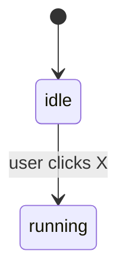

# Feature Name

**Status:** Draft | In progress | Shipped
**Date:** DD-MM-YYYY
**Last updated:** DD-MM-YYYY

## 1. What are all the states?

<list every state the UI/feature can be in>

## 2. What are the transactions?

<who triggers each transaction; state machine if useful>

## 3. What does the user see in each state?

< table or list mapping state -> UI >

## 4. What could I user do that I did'nt expect?

< edge cases, weird flows, race conditions, etc>

## 5. What product design is finalized?

< name the decision - these are not code decisions >

## Open Questions

< things I don't know or yet to finalized >

## Resolved decisions

< after discussion, record what you choose & why >
