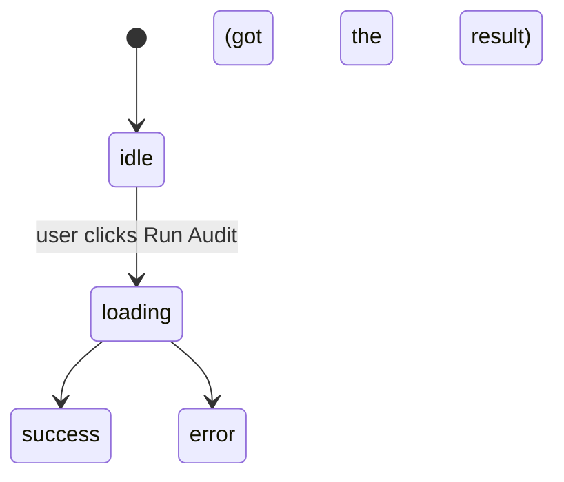

# On-Demand Audit

**Status:** In progress
**Date:** 2026-04-18
**Last updated:** 2026-04-18

## 1. States (mainly for ResultPanel)

- ideal
- loading
- error
- success (results)
- cache result for a current URL
- cache result for different URL

## 2. Transactions

## 3. What does the user see in each state?

- ideal - <AuditLanding> component
- loading - <Loading> component
- error - <Error> component
- success - <ViolationList> or Perfect score section

## 4. What could I user do that I did'nt expect?

< edge cases, weird flows, race conditions, etc>

## 5. What product design is finalized?

< name the decision - these are not code decisions >

## Open Questions

< things I don't know or yet to finalized >

## Resolved decisions

< after discussion, record what you choose & why >
